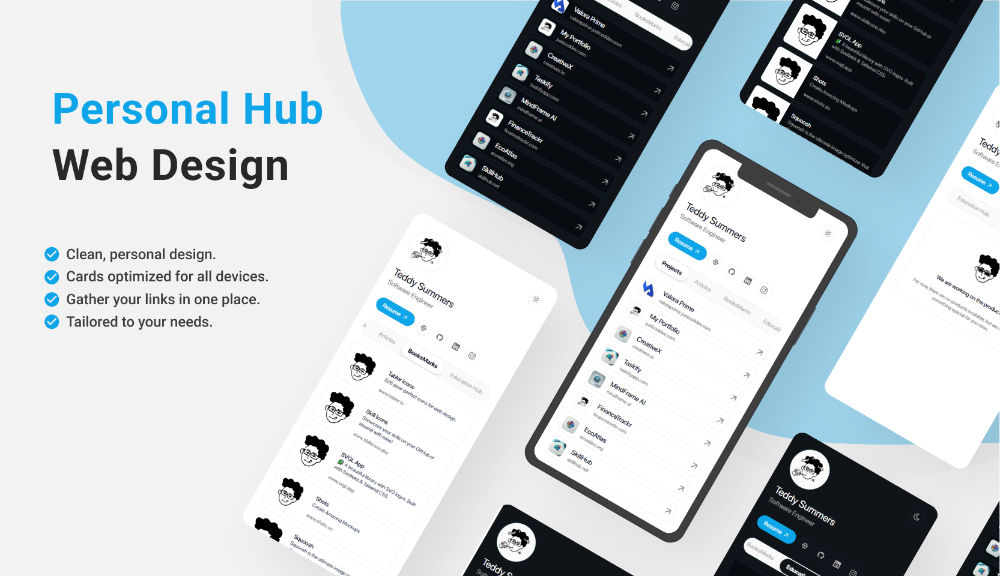
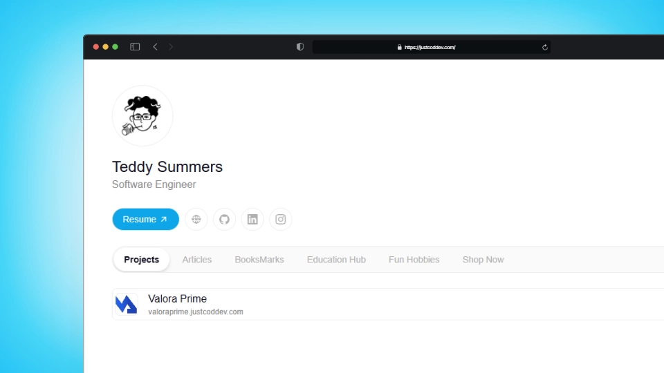
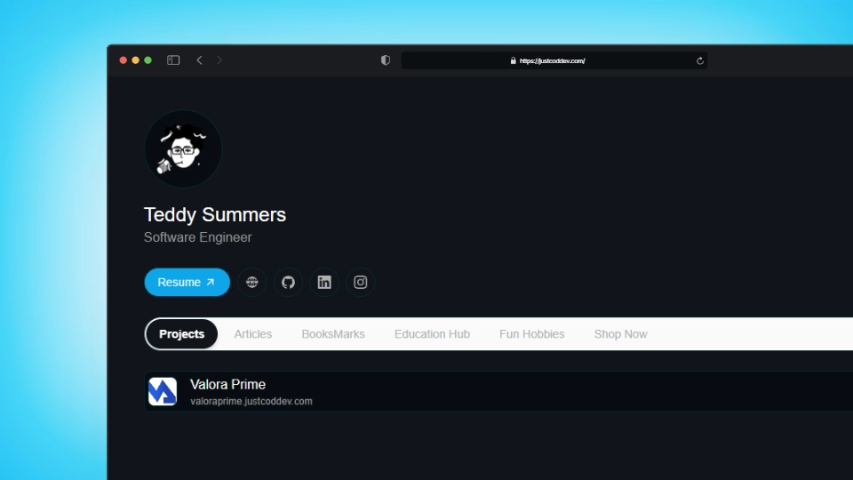
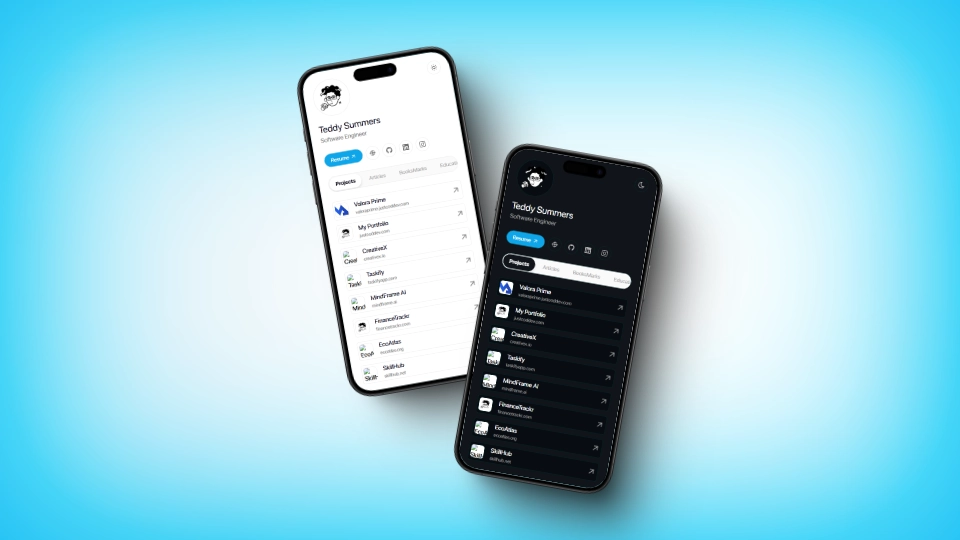
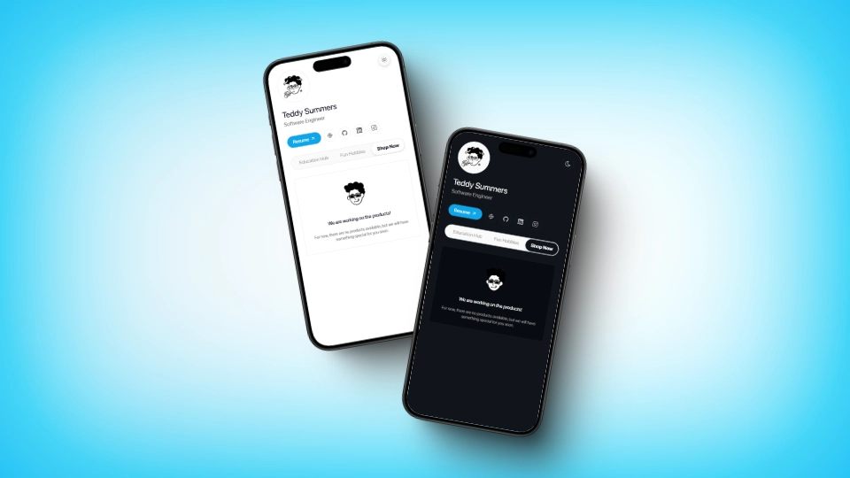

# Kelvin Maina Wangari - Portfolio

[](https://github.com/kelvinmaina/kelvinmaina-portfolio) [](https://opensource.org/licenses/MIT) [](https://astro.build/themes/details/personal-hub-a-customizable-personal-link/)



## Description

Kelvin Maina Wangari's professional portfolio showcasing experience as a Technical Educator & Software Developer. This portfolio highlights projects, skills, education, and professional experience in full-lifecycle software development, including mobile and web applications.

## Table of Contents

- [Features](#features)
- [Technologies Used](#technologies-used)
- [Installation](#installation)
- [Usage](#usage)
- [Screenshots](#screenshots)
- [License](#license)
- [Contact](#contact)

## Features

- **Centralized Management**: Access all your information from a single place.
- **Customization**: Configure and adapt the interface to your needs.
- **Integrations**: Connect with various platforms and external services.
- **Security**: Protect your data with proper authentication and authorization.

## Technologies Used

- **Astro**: Main framework for building the interface.
- **Tailwind CSS**: Styling and responsive design.
- **Vercel**: Deployment and hosting of the application.

## Installation

You can use this template in two ways:

### 1. Quick Start (Recommended)

Create a new project using this template with:

   ```bash
npm create astro@latest -- --template itsteddydev/hub-itsteddydev
   ```

### 2. Manual Installation
Follow these steps to install and run the project locally:

1. **Clone the repository**:

   ```bash
   git clone https://github.com/itsteddydev/hub-itsteddydev.git
   ```

2. **Navigate to the project directory**:

   ```bash
   cd hub-itsteddydev
   ```

3. **Install dependencies**:

   ```bash
   npm install
   ```

4. **Start the development server**:

   ```bash
   npm run dev
   ```

5. Open your browser and visit `http://localhost:4321` to see the application in action.


## Usage

Once the application is running, you can:

- **Customize your profile**: Add, edit, or remove personal information.
- **Add links**: Include links to your projects, social media, or any relevant resources.
- **Configure widgets**: Enable or disable modules according to your preferences.

## Screenshots










## License

This project is licensed under the MIT License. See the [LICENSE](./LICENSE) file for more details.

## Contact

For inquiries, suggestions, or feedback, you can reach me through:

- **Email**: wkelvinmaina@gmail.com
- **LinkedIn**: [kelvinmaina](https://www.linkedin.com/in/kelvinmaina/)
- **GitHub**: [kelvinmaina](https://www.github.com/kelvinmaina)

---

Thank you for visiting my portfolio! Feel free to reach out for collaboration opportunities or questions about my work.
